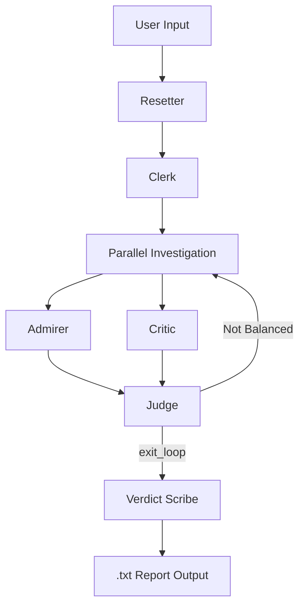

# 🏛️ The Historical Court: Multi-Agent System Analysis

โปรเจกต์นี้พัฒนาระบบ Multi-Agent ด้วย **Google Agent Development Kit (ADK)**  
เพื่อวิเคราะห์บุคคลหรือเหตุการณ์สำคัญทางประวัติศาสตร์ในรูปแบบ “ศาลจำลอง”  
โดยเน้นการสืบค้นข้อมูลรอบด้านจาก Wikipedia เพื่อสร้างรายงานที่สมดุล เป็นกลาง และอ้างอิงเชิงเหตุผล

---

## 🏗️ System Architecture

ระบบถูกออกแบบเป็นลำดับขั้น (Structured Pipeline Architecture) เพื่อควบคุมคุณภาพข้อมูล ความสมดุล และเงื่อนไขการสิ้นสุดการทำงานอย่างชัดเจน

### Step 1: The Inquiry (Sequential Phase)

- **Clerk (Inquiry Agent)**  
  รับหัวข้อจากผู้ใช้ วิเคราะห์ และสกัดชื่อหัวข้อหลักเพื่อบันทึกลงใน Session State (`topic`)

- **Resetter**  
  ล้างค่า State เดิมทั้งหมดก่อนเริ่มการพิจารณาใหม่ เพื่อป้องกันข้อมูลตกค้าง (State Contamination)

---

### Step 2: The Investigation (Parallel Phase)

ขั้นตอนการสืบค้นข้อมูลเชิงลึกแบบขนาน (Parallel Research) เพื่อลดอคติของข้อมูล

- **Agent A – The Admirer**  
  ค้นหาเฉพาะด้านบวก เช่น  
  *achievements, accomplishments, reforms, positive impact*

- **Agent B – The Critic**  
  ค้นหาด้านลบและข้อถกเถียง เช่น  
  *controversy, criticism, failure, human rights issues*

ข้อมูลถูกจัดเก็บแยกกันอย่างชัดเจนใน:
- `pos_data`
- `neg_data`

---

### Step 3: The Trial & Review (Controlled Loop Phase)

- **Agent C – The Judge**  
  ตรวจสอบความครบถ้วนและสมดุลของข้อมูลใน State

- **Loop Logic**  
  หากข้อมูลฝั่งใดมีน้อยกว่า 4 ประเด็น  
  Judge จะสร้าง `judge_feedback` และส่งกลับไปยังขั้นตอน Investigation

- **Strict Termination Rule**  
  การจบ Loop ทำได้ *เฉพาะ* การเรียกใช้เครื่องมือ `exit_loop` เท่านั้น  
  และ Agent ต้องหยุดทำงานทันทีหลังเรียก Tool เพื่อป้องกัน Infinite Loop

---

### Step 4: The Verdict (Final Output Phase)

- **Verdict Scribe**  
  รวบรวมข้อมูลทั้งหมดและเรียบเรียงเป็นรายงานเชิงวิชาการภาษาไทย โดยแบ่งเป็น:

  1. ความสำเร็จและคุณูปการ
  2. ข้อวิจารณ์และข้อถกเถียง
  3. บทสรุปเชิงวิเคราะห์ที่เป็นกลาง

ผลลัพธ์ถูกบันทึกเป็นไฟล์ `.txt`

---

## 🔄 System Workflow Diagram

---

## 🧠 Session State Structure

| Key | Type | Description |
|------|------|------------|
| topic | str | หัวข้อประวัติศาสตร์ |
| pos_data | list | ข้อมูลด้านบวก |
| neg_data | list | ข้อมูลด้านลบ |
| judge_feedback | str | ข้อเสนอแนะจาก Judge |
| pos_round | int | จำนวนรอบการสืบค้นฝั่งบวก |
| neg_round | int | จำนวนรอบการสืบค้นฝั่งลบ |

---

## 🛠️ Technical Design Constraints

- **Wiki Research Strategy**  
  ใช้ Suffix Keywords แยกตามบทบาทของ Agent เพื่อควบคุมขอบเขตข้อมูล

- **State Management Discipline**  
  ใช้ Key แยกชัดเจน และส่งต่อข้อมูลด้วย Templating `{ key? }`

- **Loop Control Policy**  
  จำกัดการสิ้นสุด Loop ด้วย `exit_loop` tool เท่านั้น

- **Strict Stop Instruction**  
  Agent ต้องหยุดทำงานทันทีหลังเรียก Tool เพื่อป้องกัน Unknown Error และ Recursive Execution

---

## 📊 Sample Analytical Capability

ระบบสามารถสร้างรายงานเชิงวิเคราะห์ที่มีความสมดุลสูง  
เช่นกรณีของ:

- เจงกีสข่าน  
- สงครามเย็น  

โดยแสดงทั้งมุมมองด้านการปฏิรูป นวัตกรรม และผลกระทบเชิงลบด้านมนุษยธรรมอย่างเป็นระบบ

---

## 🎯 Design Rationale

ระบบถูกออกแบบให้ใช้:

- **Sequential Control** เพื่อความถูกต้องของ State
- **Parallel Investigation** เพื่อลด Bias
- **Controlled Loop with Tool-Based Termination** เพื่อความเสถียรของระบบ
- **Strict Agent Role Separation** เพื่อเพิ่มความชัดเจนเชิงสถาปัตยกรรม

โครงสร้างนี้สะท้อนแนวคิด Multi-Agent Orchestration อย่างเป็นระบบภายใต้ Google ADK

---

**จัดทำโดย**:  
จิรัชยา ตั้งนำประเสริฐ  
King Mongkut’s Institute of Technology Ladkrabang (KMITL)

