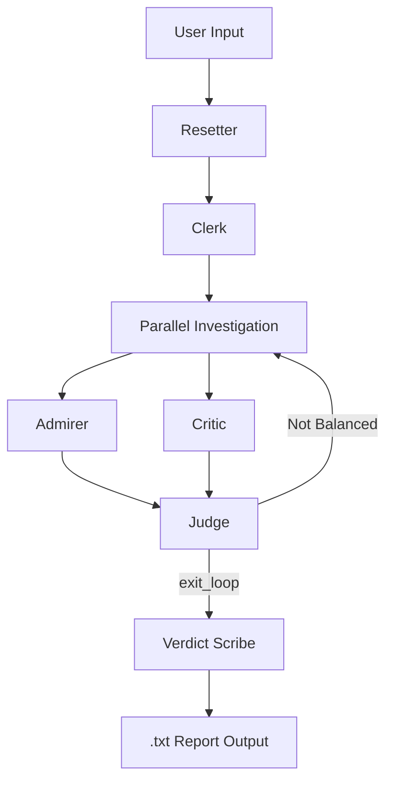

# 🏛️ The Historical Court: Multi-Agent System Analysis

โปรเจกต์นี้พัฒนาระบบ Multi-Agent ด้วย **Google Agent Development Kit (ADK)**  
เพื่อวิเคราะห์บุคคลหรือเหตุการณ์สำคัญทางประวัติศาสตร์ในรูปแบบ “ศาลจำลอง”  
โดยเน้นการสืบค้นข้อมูลรอบด้านจาก Wikipedia เพื่อวิเคราะห์บุคคลหรือหัวข้อทางประวัติศาสตร์แบบมีทั้งด้านบวกและด้านลบ แล้วสรุปเป็นรายงานที่สมดุล เป็นกลาง และอ้างอิงเชิงเหตุผลเป็นไฟล์ .txt อัตโนมัติ

---

# 🧠 Core Architecture Overview

ระบบใช้แนวคิด Structured Multi-Agent Orchestration โดยแบ่ง Agent ออกเป็น 4 Phase หลัก:

| Phase | Architecture Pattern | Purpose |
|-------|----------------------|----------|
| Inquiry | Sequential | เตรียมหัวข้อ |
| Investigation | Parallel | ลด Bias |
| Trial | Controlled Loop | ตรวจสมดุล |
| Verdict | Sequential | สรุปรายงาน |

Agent Types ที่ใช้:

- `SequentialAgent`
- `ParallelAgent`
- `LoopAgent`

---

# ⚙️ Initial System Configuration

## Environment Setup

```python
import os
import logging
import google.cloud.logging
from dotenv import load_dotenv

from google.adk import Agent
from google.adk.agents import SequentialAgent, LoopAgent, ParallelAgent
from google.adk.models import Gemini
from google.adk.tools import exit_loop
from google.adk.tools.tool_context import ToolContext
from google.genai import types
```

### Logging + Environment

```python
google.cloud.logging.Client().setup_logging()
load_dotenv()

MODEL_NAME = os.getenv("MODEL")
RETRY_OPTIONS = types.HttpRetryOptions(initial_delay=1, attempts=6)

SHARED_MODEL = Gemini(model=MODEL_NAME, retry_options=RETRY_OPTIONS)
```

ระบบใช้โมเดล Gemini ผ่าน Google ADK โดยกำหนด Retry Policy เพื่อเพิ่มเสถียรภาพ

---

# 🧩 STATE MANAGEMENT TOOLS (Strict Requirement)

State Management เป็นหัวใจของระบบนี้  
เพื่อป้องกัน State Contamination และควบคุม Loop อย่างแม่นยำ

## 1️⃣ set_state

```python
def set_state(tool_context: ToolContext, field: str, value: str):
    tool_context.state[field] = value
    return {"status": "success"}
```

---

## 2️⃣ append_state

```python
def append_state(tool_context: ToolContext, field: str, value: str):
    existing = tool_context.state.get(field, [])
    if not isinstance(existing, list):
        existing = []
    existing.append(value)
    tool_context.state[field] = existing
    return {"status": "success"}
```

---

## 3️⃣ reset_case

```python
def reset_case(tool_context: ToolContext):
    tool_context.state["topic"] = ""
    tool_context.state["pos_data"] = []
    tool_context.state["neg_data"] = []
    tool_context.state["judge_feedback"] = ""
    tool_context.state["pos_round"] = 0
    tool_context.state["neg_round"] = 0
    return {"status": "reset"}
```

---

## 4️⃣ write_file

```python
def write_file(tool_context: ToolContext, directory: str, filename: str, content: str):
    os.makedirs(directory, exist_ok=True)
    path = os.path.join(directory, filename)

    with open(path, "w", encoding="utf-8") as f:
        f.write(content)

    return {"status": "success", "path": path}
```

---

# 🌍 Wikipedia Research Tool

ระบบใช้ Wikipedia เป็นแหล่งข้อมูลหลักผ่าน LangChain Tool Wrapper

```python
from langchain_community.tools import WikipediaQueryRun
from langchain_community.utilities import WikipediaAPIWrapper
from google.adk.tools.langchain_tool import LangchainTool

wiki_tool = LangchainTool(
    tool=WikipediaQueryRun(
        api_wrapper=WikipediaAPIWrapper()
    )
)
```

Design Strategy:

- ใช้ Suffix Keywords ควบคุมขอบเขตข้อมูล
- แยก Query ตามบทบาท Agent
- ลด Bias ด้วย Parallel Research

---

# 🏛️ STEP 1 — The Inquiry (Sequential Phase)

## Clerk Agent

```python
clerk = Agent(
    name="clerk",
    model=SHARED_MODEL,
    instruction="""
Extract ONLY the historical topic from user input.

Call:
set_state(field="topic", value="<topic_name>")

Do NOT output text.
Stop immediately.
""",
    tools=[set_state],
)
```

หน้าที่:
- แยกหัวข้อจากผู้ใช้
- บันทึกลง `topic`

---

# 🔍 STEP 2 — The Investigation (Parallel Phase)

## Agent A — The Admirer

```python
admirer = Agent(
    name="admirer",
    model=SHARED_MODEL,
    instruction="""
You are Agent A: The Admirer.

Goal:
Collect POSITIVE achievements of {topic}.

SEARCH STRATEGY:
- "{topic} achievements"
- "{topic} accomplishments"
- "{topic} positive impact"
- "{topic} scientific contributions"

RULES:
- Add ONLY 2 new distinct achievements per round
- Avoid duplication
- Write concise Thai bullet sentences
- Use append_state(field="pos_data", value="...")

Do not output explanation text.
""",
    tools=[wiki_tool, append_state],
)
```

---

## Agent B — The Critic

```python
critic = Agent(
    name="critic",
    model=SHARED_MODEL,
    instruction="""
You are Agent B: The Critic.

Goal:
Collect NEGATIVE aspects or controversies of {topic}.

SEARCH STRATEGY:
- "{topic} controversy"
- "{topic} criticism"
- "{topic} failure"
- "{topic} historical rivalry"

RULES:
- Add ONLY 2 new distinct criticisms per round
- Avoid duplication
- Write concise Thai bullet sentences
- Use append_state(field="neg_data", value="...")

Do not output explanation text.
""",
    tools=[wiki_tool, append_state],
)
```

---

## Parallel Execution

```python
investigation_team = ParallelAgent(
    name="investigation_team",
    sub_agents=[admirer, critic],
)
```

---

# ⚖️ STEP 3 — The Trial (Loop Control Phase)

## Judge Agent

```python
judge = Agent(
    name="judge",
    model=SHARED_MODEL,
    instruction="""
Review:

Positive Points:
{pos_data?}

Negative Points:
{neg_data?}

Decision Rules:

1. If negative side < 4 points:
   Call set_state(field="judge_feedback", value="Need more negative analysis.")
   DO NOT call exit_loop.

2. If positive side < 4 points:
   Call set_state(field="judge_feedback", value="Need more positive analysis.")
   DO NOT call exit_loop.

3. If BOTH sides >= 4:
   Call exit_loop EXACTLY ONCE.

Do not output text.
""",
    tools=[set_state, exit_loop],
)
```

---

## Loop Controller

```python
court_trial = LoopAgent(
    name="court_trial",
    sub_agents=[investigation_team, judge],
    max_iterations=6,
)
```

Strict Termination Rule:

- Loop จบได้เฉพาะ `exit_loop`
- Agent ต้องหยุดทันทีหลังเรียก Tool

---

# 📜 STEP 4 — The Verdict

## Verdict Scribe

```python
verdict_scribe = Agent(
    name="verdict_scribe",
    model=SHARED_MODEL,
    instruction="""
Create a neutral academic Thai report about {topic}.

Use:
Positive Data: {pos_data}
Negative Data: {neg_data}

STRUCTURE:

1) ความสำเร็จ
- bullet points

2) ข้อโต้แย้งและข้อวิจารณ์
- bullet points

3) บทสรุปเชิงเป็นกลาง

Then call:
write_file(
    directory="court_reports",
    filename="{topic}_verdict.txt",
    content="<full_report>"
)

Do not output text.
""",
    tools=[write_file],
)
```

---

# 🏗️ Root System Workflow

```python
resetter = Agent(
    name="resetter",
    model=SHARED_MODEL,
    instruction="""
Call reset_case once.
Do not output text.
""",
    tools=[reset_case],
)

root_agent = SequentialAgent(
    name="historical_court_system",
    sub_agents=[resetter, clerk, court_trial, verdict_scribe],
)
```

---

# 📊 Session State Structure

| Key | Type | Description |
|------|------|------------|
| topic | str | หัวข้อ |
| pos_data | list | ด้านบวก |
| neg_data | list | ด้านลบ |
| judge_feedback | str | คำแนะนำ Judge |
| pos_round | int | รอบฝั่งบวก |
| neg_round | int | รอบฝั่งลบ |

---

# 🔄 System Workflow Diagram



---

# 🎯 Design Rationale

ระบบสะท้อนแนวคิด Multi-Agent Orchestration อย่างเป็นระบบ โดยใช้:

- Sequential Control เพื่อควบคุม State
- Parallel Investigation เพื่อลด Bias
- Controlled Loop เพื่อป้องกันข้อมูลไม่ครบ
- Tool-Based Termination เพื่อป้องกัน Infinite Loop
- Strict Agent Role Separation เพื่อเพิ่มความเสถียรของระบบ

---

# 👩🏻‍🎓 จัดทำโดย

จิรัชยา ตั้งนำประเสริฐ  
รหัสนักศึกษา 66010125  

King Mongkut’s Institute of Technology Ladkrabang (KMITL)
